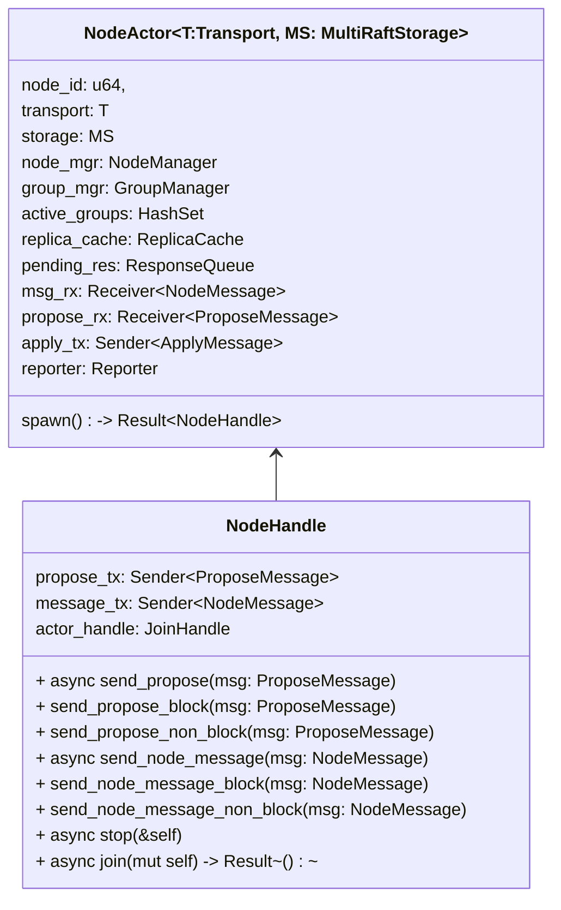

## Node

A node is an abstraction of a cluster node. Each node manages multiple Raft groups. The node receives Raft messages from other nodes and processes them to drive the execution of the Raft algorithm. The node also functions as a heartbeat group to manage heartbeat information for all Raft instances on that node.

## Actor

NodeActor is an abstraction for the computation performed by a node. NodeActor runs in a separate asynchronous task, encapsulating state and data structures, and interacts with the outside world through messages.

After NodeActor runs, it returns a NodeHandle, which is used for communication with the NodeActor. Additionally, the NodeHandle is responsible for managing the lifecycle of the NodeActor.

- Handling requests from clients
- Handling messages from other Raft replicas
- Processing requests from administrators
- Managing the state of Raft groups
- Recording monitoring information 

The `NodeActor::spawn` method creates an actor and returns a `NodeHandle`. The `stop` method of the handle sends a stop signal to the actor, and you can use the `join` method to wait for the actor to finish.

## Actor Loop

TODO

## Heartbeat Merge

TODO

### A some corner case

TODO

