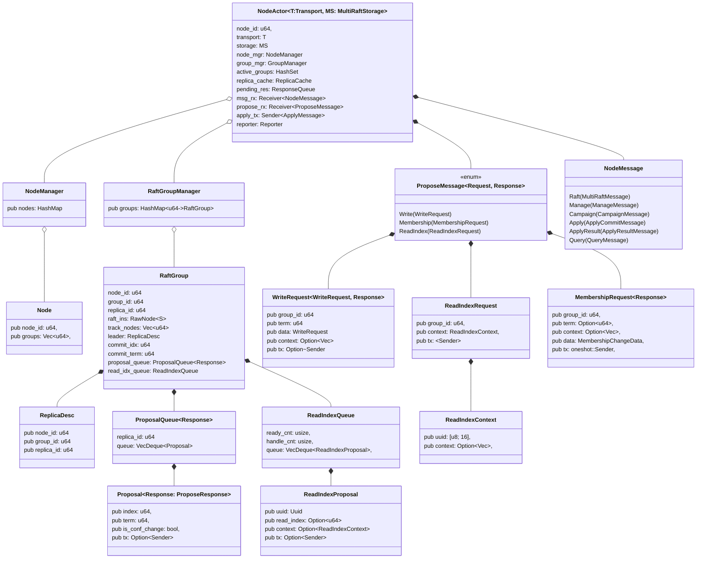

## Node

A node is an abstraction of a cluster node. Each node manages multiple Raft groups. The node receives Raft messages from other nodes and processes them to drive the execution of the Raft algorithm. The node also functions as a heartbeat group to manage heartbeat information for all Raft instances on that node.

## Actor

NodeActor is an abstraction for the computation performed by a node. NodeActor runs in a separate asynchronous task, encapsulating state and data structures, and interacts with the outside world through messages.

After NodeActor runs, it returns a NodeHandle, which is used for communication with the NodeActor. Additionally, the NodeHandle is responsible for managing the lifecycle of the NodeActor.

- Handling requests from clients
- Handling messages from other Raft replicas
- Processing requests from administrators
- Managing the state of Raft groups
- Recording monitoring information 

The `NodeActor::spawn` method creates an actor and returns a `NodeHandle`. The `stop` method of the handle sends a stop signal to the actor, and you can use the `join` method to wait for the actor to finish.

## Actor Loop

Node actor 启动后运行一个 event loop 来处理各类消息
- 处理来自其他节点的 raft 的消息
- 根据 tick 次数像其他节点发送心跳消息
- 处理来自客户端的提议
- 处理 apply 发送的结果
- 处理成员变更提交
- 响应客户端

## Heartbeat Merge

一个节点可能有上万甚至数十万个 raft group，每个 raft group 都会定期交换心跳，这意味着可能每间隔一段事件产生几十万个心跳消息，从而对节点稳定性造成影响。

实际上我们可以将心跳合并从而减少消息的数量。一般来说，我们认为如果节点是稳定的，那么节点上的 raft group 也是稳定的，所以可以将原本需要由 raft group 发送的心跳信息改为由节点发送。同时，当收到来自其他节点的心跳消息时，我们转发给节点上的多个 raft group。

但实际上还存在一些细微的差异。在 raft 算法中，要求由 leader 发送心跳，但是在节点级别下，一个节点可能存在多个 raft group，一些可能是 leader，一些可能不是，因此在这种情况下，节点只要到达 tick 次数就会发送心跳。这个修改不会影响 raft 算法的正确性，也不会影响活性，但需要满足
- 当节点收到其他节点发送的心跳信息转发

TODO

### A some corner case

TODO

